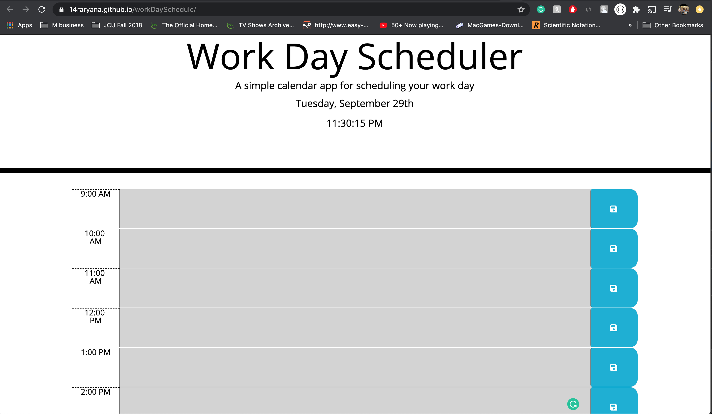

# workDaySchedule
Homework 5

## What is workDaySchedule
The purpose of this program is to give the user a schedule with normal business hours and allow them to add certain events that they either need to do or things that are happening at certain times throughout the day.  The users events are saved to local storage so the user does not need to worry about their events being deleted upon refresh. If the user did want to delete events from their schedule they simply delete it from text area and press save button again.

## Run through of program

1. ### Heading
The top of this web application tells the user what it is that the program is while also providing the user with the correct date and actively updated time.  The user does not need to refresh the page for the time to change.  The time refreshes on its own so the correct time and date will always be displayed.

2. ### Schedule/body
The body of this program provides the user the schedule portion of the program.  Each block that is displayed shows the time that it is referring to, a text area for the user to be able to add events and specify what time they occur at, and finally a save button that will save the users written events to local storage.

### Text Area
The text area that is provided for the user are all color coded. Gray for times that have already passed, red for the present time, and green for future times in the day. The users events that are written in the text area are all saved to local storage so the user can close out of the page and still have their events saved the next time they come to the website.  

### Save Button
The save button is the functional portion for the text area. On clicking of the save button the user will be saving the corresponding events added to the text area into local storage. If the user wants to delete events they simply delete it from the text area and click the save button again.

## Link to GitHub Pages for this site:
https://14raryana.github.io/workDaySchedule/

## Picture of Website:
